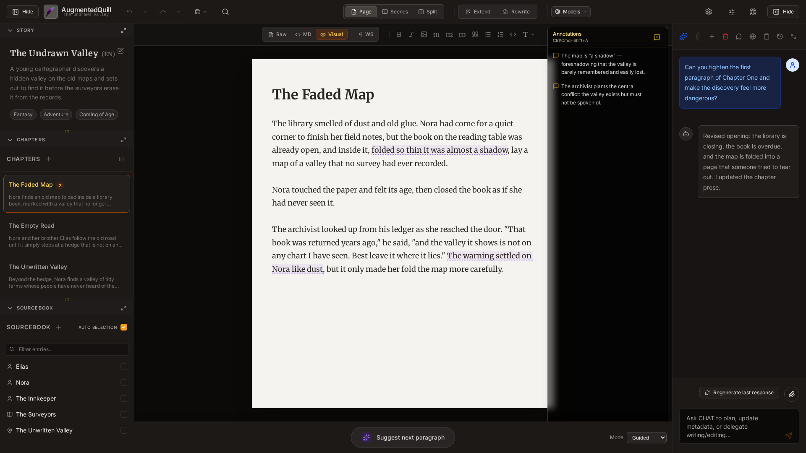

# Getting Started with AugmentedQuill

AugmentedQuill is designed to be a seamless extension of your creative process. It combines a traditional writing environment with powerful AI tools that understand your story's context.

> Your story belongs to you. AugmentedQuill keeps you in the driver seat: every beat, character voice, and plot decision is always yours. AI is here as a collaborator—to brainstorm, refine, and ghostwrite in ways that match your intent, not replace it.

## Installation

AugmentedQuill does not run entirely in the cloud — you install it on your own machine (or a server you control) and it talks to an AI model provider you configure. Choose the method that fits you best:

| Method                                  | Best for                                          | Where to look                                                                                                                                                                                            |
| --------------------------------------- | ------------------------------------------------- | -------------------------------------------------------------------------------------------------------------------------------------------------------------------------------------------------------- |
| **Portable executable**                 | Authors & artists who want to double-click and go | Download the executable for your OS from the [Releases](https://github.com/StableLlamaAI/AugmentedQuill/releases) page. It starts a local server and opens AugmentedQuill in your browser automatically. |
| **Docker**                              | Self-hosters & home servers                       | `docker compose up -d`, then open `http://localhost:8000/`.                                                                                                                                              |
| **Electron desktop app** (experimental) | A native-feeling windowed application             | Work in progress; see the installation guide.                                                                                                                                                            |
| **From source**                         | Tinkerers & contributors                          | See the [Developer Guide](../../DEVELOPMENT.md).                                                                                                                                                         |

The complete, step-by-step [Installation Guide](../../INSTALL.md) covers every method in detail. You can come back to install later — everything below assumes the app is already running in your browser.

> **Tip:** For the simplest setup, use the published releases. Building from source is intended for development and contribution.

## Setting Up Your AI Models

AugmentedQuill is a writing tool, not a model host — it does **not** bundle an AI server. Before you can use the AI features (chat, Extend/Rewrite, suggestions, summaries), you need to point AugmentedQuill at an LLM provider. Two steps are required:

1. **Choose a provider** — a local server on your machine (`llama.cpp` or Ollama), or a cloud API (OpenAI, Anthropic Claude, Google Gemini, DeepSeek, OpenRouter, or any other OpenAI-compatible service). Local models run on your hardware for free; cloud APIs charge per token and need an API key.
2. **Configure it in _Machine Settings_** — open **Settings** → **Machine Settings**, add a provider with its base URL, API key (if any), and model ID, then assign it to the **WRITING**, **EDITING**, and **CHAT** roles.

The [Machine Settings tab](02_projects_and_settings.md#the-machine-settings-tab) in [Projects and Settings](02_projects_and_settings.md) explains the roles, fields, and parameters in full, and the [Connecting to Popular Providers](02_projects_and_settings.md#connecting-to-popular-providers) section gives ready-made base URLs and example model IDs for **local llama.cpp, Ollama, OpenRouter, OpenAI, Claude, Google Gemini, and DeepSeek**.

If your provider is not reachable, the [Troubleshooting & FAQ](13_troubleshooting.md) chapter covers the common causes (wrong base URL, missing key, CORS).

## What AugmentedQuill Can Do For You

- **Write with AI that knows your world** — the editor's **Extend**, **Rewrite**, and **Suggest** tools draft, continue, and polish prose using your story's own context.
- **Keep every character, place, and rule consistent** — the [Sourcebook](05_sourcebook.md) feeds the AI the same canon on every call, so names and lore stay straight.
- **Plan structure like a pro** — chapters, [conflicts](04_chapters_and_books.md#managing-chapters), and books keep long-form work organized, from short story to multi-volume series.
- **Turn your sketches into prompts** — [manage reference art](09_project_images.md) and ask an artist or use external AI to generate image prompts in your project's style.
- **Coordinate everything through chat** — brainstorm, delegate prose, update metadata, and build your world without leaving the writing flow.

## Important Limits (As of 2026)

- AugmentedQuill is local-first and not designed for public internet deployment without adding your own security layer.
- No built-in user authentication or per-project access control exists. Treat the running instance as trusted local software.
- No external editor sync is provided; project data is kept in local folders (e.g., `data/projects/`).
- Accessibility support is implemented for core flows (ARIA semantics, visible focus, keyboard shortcuts, focus-trapped dialogs) but not WCAG-certified. See [Keyboard Shortcuts & Accessibility](14_keyboard_shortcuts_and_accessibility.md) for the full picture, including known gaps.

## Core Concepts

Before diving in, it's helpful to understand how AugmentedQuill organizes your work:

- **Projects**: A project is the container for your entire short story, novel, or series. It holds everything related to that specific work.
- **Story Metadata**: The overarching information about your project — the title, synopsis, style tags, and notes that guide the AI.
- **Chapters**: The actual prose of your story. A short story exposes one chapter-like writing unit, a novel uses a flat chapter list, and a series stores chapters inside books.
- **Sourcebook**: Your story's encyclopedia. This is where you keep track of characters, locations, lore, items, and other important details. The AI uses this to stay consistent.
- **Chat Assistant**: Your AI coordinator. You can brainstorm, ask for suggestions, let it maintain metadata, or let it delegate prose writing to WRITING and prose refinement to EDITING.

## The Main Interface

When you open AugmentedQuill, you'll be greeted by the main writing environment. The interface is divided into three main panels plus a persistent header bar across the top:



> **In this screenshot:** the three-panel workspace. **Left:** Story Metadata, Chapters, and Sourcebook. **Center:** the editor with your active chapter. **Right:** the AI Chat Assistant. The header bar across the top holds settings, undo/redo, view modes, and model selectors.

1. **Left Sidebar** — Your project's control center. Scroll through it to find:
   - **Story Metadata**: The story title, summary, style tags, and LLM-visible notes at a glance. Click the  pencil icon to open the full Metadata Editor.
   - **Chapters** (or Books & Chapters in a series): The navigation list for your prose. In a short story this shows the single writing unit; in other project types it shows the active chapter structure. Click any entry to open it in the editor; drag entries to reorder them where supported.
   - **Sourcebook**: A searchable list of every character, location, and lore entry in your world.

2. **Main Area (The Editor)** — The central writing canvas. It shows the active chapter title and body, along with the AI suggestion footer at the bottom.

3. **Right Sidebar (Chat Assistant)** — Your AI co-writer. Type anything here: brainstorm a scene, ask for a critique, or request the AI to take an action (like creating a Sourcebook entry or updating your story summary).

On mobile and small tablets the left sidebar slides in from the left edge and the chat panel slides in from the right, keeping the editor full-screen until you need them.

## The Top Header Bar

A persistent bar runs across the top of the screen. From left to right it contains:

### Left Section

| Control                                                                                                                                      | Description                                                                                                                         |
| -------------------------------------------------------------------------------------------------------------------------------------------- | ----------------------------------------------------------------------------------------------------------------------------------- |
| **☰ menu** (mobile only)                                                                                                                    | Tap the hamburger icon to open the left sidebar on small screens.                                                                   |
| **AugmentedQuill logo + project title**                                                                                                      | Click the logo or the application name to open the **Settings** dialog. The active project's name appears just below as a subtitle. |
| **Undo** ( counterclockwise arrow) | Undoes the last text change in the editor. Disabled when there is nothing left to undo.                                             |
| **Redo** (clockwise arrow)                                                                                                                   | Re-applies the last undone change. Disabled when you are already at the most recent version.                                        |

### Center Section

The center of the header packs in four groups of controls that help you write and interact with the AI. On smaller screens some groups collapse into dropdown menus so the header stays tidy.

**View Mode** — Choose how the editor displays your text:

- **Raw**: Plain-text mode for clean markdown editing with a monospace look.
- **MD**: Markdown-highlighted mode — syntax highlighting shows heading markers, bold, and italic without rendering them.
- **Visual**: WYSIWYG (What You See Is What You Get) — headings and bold text render as they would in a finished document.
- **WS** ( Pilcrow): Toggle to show invisible whitespace characters (spaces, tabs, paragraph breaks). Useful when formatting is behaving unexpectedly.

On mobile a single **View** dropdown (showing the current mode and a chevron) collapses these four options.

**Format Toolbar** — Shortcuts for common markdown formatting (visible on larger screens; available inside the Format menu on mobile):

- **B** (Bold): Wraps the selected text in `**bold**` markers.
- **I** (Italic): Wraps the selection in `_italic_` markers.
- **Image**: Opens the project image picker and inserts an `` tag at the cursor.
- **H1**, **H2**, **H3**: Prepend the appropriate heading level to the selected line.
- **Quote** (blockquote icon): Inserts a `> ` blockquote prefix.
- **List** (bullet list icon): Starts an unordered `- ` list.
- **Numbered List** (numbered list icon): Starts an ordered `1. ` list.
- **Link** (): Inserts a `[text](url)` link skeleton.
- **Footnote** (hash icon): Inserts a numbered footnote reference and a matching definition block.
- **Code Block** (code icon): Wraps the selection in a fenced code block ` ``` … ``` `.
- **Subscript** / **Superscript**: Wraps the selection in `~…~` or `^…^`.
- **Strikethrough**: Wraps the selection in `~~…~~`.

On medium screens the less common buttons collapse into a **Format** dropdown (the  Type icon with chevron). See [The Writing Interface](03_writing_interface.md#supported-markdown-elements) for the full list of all supported markdown elements, including tables and inline code.

**Chapter AI** — Two quick actions that call the   [WRITING model](02_projects_and_settings.md#the-three-ai-model-roles) on the current chapter:

- **Extend** (): Appends a continuation of the chapter using the story context.
- **Rewrite** (): Regenerates the chapter body while keeping the same summary and style tags.

**Model Selectors** (visible on wide screens) — Three small dropdowns show which AI provider is assigned to each role. Click one to swap providers on the fly without opening Settings. See [Projects and Settings](02_projects_and_settings.md#the-three-ai-model-roles) for the meaning of each role.

### Right Section

| Control                                                                                                                             | Description                                                                                                                                                             |
| ----------------------------------------------------------------------------------------------------------------------------------- | ----------------------------------------------------------------------------------------------------------------------------------------------------------------------- |
| **Images** ( image icon)    | Opens the **Project Images** dialog to manage all visual assets for this project. (See [Project Images](09_project_images.md).)                                         |
| **Settings** ()     | Opens the Settings dialog (same as clicking the logo).                                                                                                                  |
| **Appearance** ( Type icon) | Opens the Appearance popup to adjust the visual theme, font size, and line width. (See [Appearance and Display](10_appearance_and_display.md).)                         |
| **Debug Logs** (bug icon)                                                                                                           | Opens the LLM Debug Logs overlay — a developer-focused view of all AI requests and responses. (See [Appearance and Display](10_appearance_and_display.md#debug-logs).)  |
| **Hide / AI** (panel icon)                                                                                                          | Toggles the right Chat Assistant panel open or closed. The current label flips between **Hide** (chevron-right) and **AI** (chevron-left) depending on the panel state. |

---

Next up: Learn how to manage your [Projects and Settings](02_projects_and_settings.md).
