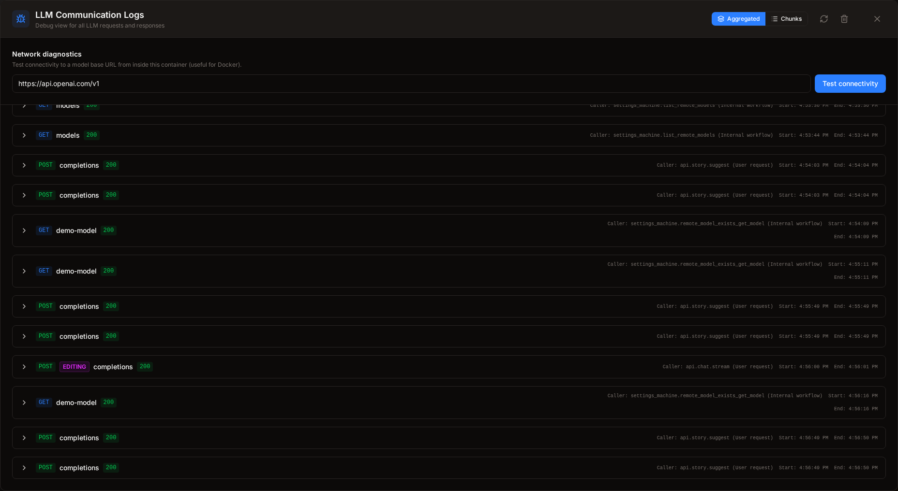
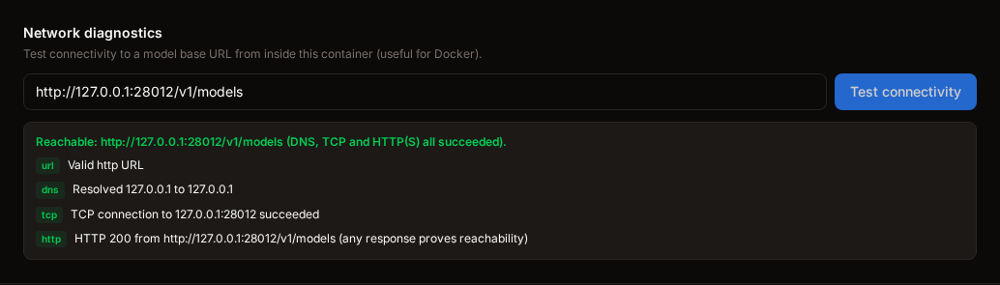

# Appearance and Display

AugmentedQuill gives you fine-grained control over how the writing environment looks and feels. The **Appearance popup** lets you adjust the visual theme, typography, and panel sizes. The **Debug Logs** overlay (for advanced users) lets you inspect every AI request your session has made.

---

## Appearance Popup

Click the  **Appearance** button (the "Aa" / Type icon) on the right side of the top header bar and a dropdown panel appears below it.

> **In this screenshot:** the Appearance popup. The **Design Mode** toggle switches the whole theme (Light / Mixed / Dark), and the five sliders below tune the editor paper, typography, and sidebar width instantly.

### Design Mode

A three-segment toggle at the top of the popup controls the overall color theme:

| Option    | Description                                                                                                                                      |
| --------- | ------------------------------------------------------------------------------------------------------------------------------------------------ |
| **Light** | The editor paper is bright white and all panels use a light color scheme. Best for daylight or well-lit rooms.                                   |
| **Mixed** | The editor paper stays light but the surrounding panels (sidebar, header, chat pane) use darker tones. A good balance for long writing sessions. |
| **Dark**  | All panels and the editor use dark backgrounds. Best for low-light environments or writers who prefer less screen glare.                         |

The mode takes effect immediately across the entire application.

### Appearance Sliders

Five range sliders below the Design Mode toggle let you tune the reading and writing environment to your preferences. All changes are applied instantly as you drag.

| Slider            | Range                  | Default | Effect                                                                                                                                                                                        |
| ----------------- | ---------------------- | ------- | --------------------------------------------------------------------------------------------------------------------------------------------------------------------------------------------- |
| **Brightness**    | 50 – 100               | 100     | Controls the brightness of the editor paper area. Lower values create a slightly off-white page that is easier on the eyes during long sessions.                                              |
| **Contrast**      | 50 – 100               | 100     | Controls the contrast of the text against the background. Reducing this slightly can soften harsh black-on-white text.                                                                        |
| **Font Size**     | 12 – 32 px             | 16 px   | Sets the base font size of the editor text. Increase for comfortable reading on large monitors; decrease to see more text at once.                                                            |
| **Line Width**    | 40 – 100 ch            | 70 ch   | Sets the maximum width of the editor column, measured in characters. Narrower lines (50–65 ch) are considered easier to read for long-form prose; wider lines let you see more text per line. |
| **Sidebar Width** | 200 – 600 px (step 10) | 320 px  | Controls the width of the left sidebar (and the right chat panel). Increase this if your project has long chapter titles or many Sourcebook entries that need more horizontal space.          |

### Closing the Popup

Click the **✕** () button in the top-right corner of the popup, or click anywhere outside it, to close the Appearance panel. All changes are preserved automatically.

---

## Debug Logs

The **Debug Logs** dialog is a developer-focused tool that shows a full transcript of every AI request AugmentedQuill has sent during the current session. It is useful for diagnosing unexpected AI behavior, verifying what context is being sent, or comparing request and response data.

Open it by clicking the **Bug** icon on the right side of the top header bar.

> **In this screenshot:** the Debug Logs dialog in Aggregated view. Each request is listed with the model and timing; one entry is expanded to show the full request and response JSON.

### Network diagnostics

At the top of the Debug Logs dialog, the **Network diagnostics** panel tests whether the backend can actually reach a provider — DNS, then TCP, then HTTPS — in one click. It is the fastest way to tell _“the machine/container can’t reach the provider”_ apart from _“the provider rejected the request”_.

> **In this screenshot:** a successful connectivity test against a local model endpoint. Each step (DNS, TCP, HTTP) is shown with its result; if a step fails, the panel highlights it so you know exactly where the connection breaks.

1. Enter the provider's base URL in the **Base URL** field (e.g. `http://127.0.0.1:11434/v1` or `https://api.openai.com/v1`).
2. Click **Test connectivity**. The panel probes the URL from the backend process, so it reflects what a real AI request would see — including inside Docker containers or a packaged desktop build.
3. A green **Reachable** summary means the network path works (auth/model errors are a separate problem). A red summary names the failing step — **DNS** (name resolution), **TCP** (can’t connect), or **HTTP** (TLS/request failure) — with an actionable hint.

The same check is available programmatically via `GET /api/v1/debug/connectivity?url=<base_url>`.

### View Modes

The toolbar at the top of the dialog offers two ways to inspect logs:

| Mode           | Icon        | Description                                                                                                                            |
| -------------- | ----------- | -------------------------------------------------------------------------------------------------------------------------------------- |
| **Aggregated** | Layers icon | Shows each request as a clean summary: the full assembled response text and any tool calls. Best for quickly reading what the AI said. |
| **Chunks**     | List icon   | Shows every raw JSON streaming chunk received from the API. Best for deep debugging of streaming issues or token usage.                |

### Toolbar Actions

| Button                                                                                                                          | Description                                                                                                 |
| ------------------------------------------------------------------------------------------------------------------------------- | ----------------------------------------------------------------------------------------------------------- |
| **Refresh** () | Re-fetches the log data from the server. Use this if you have been running requests in another browser tab. |
| **Clear** ()        | Deletes all stored log entries after confirmation.                                                          |
| **Close** ()              | Closes the dialog.                                                                                          |

### LLM Raw Log Verbosity

The backend writes raw LLM interaction data to `data/logs/llm_raw.log` when `AUGQ_LLM_DUMP=1` is set in your environment. You can adjust the verbosity using `AUGQ_LLM_DUMP_LEVEL`:

- `compact` (default): writes one entry per communication with minimal request/response payload, streaming data is summarized into `chunk_count` and `full_content_summary` with truncated chunks.
- `normal`: writes one entry per communication with reduced payload, includes streaming chunk previews (up to 20 truncated items) and non-streaming response text up to 400 characters.
- `debug`: includes full request/response objects and full streaming chunks, useful only for deep network and protocol debugging.

The compact mode is recommended for normal use because it keeps log files readable while preserving every communication event.

### Log Entries

Each entry in the log list is a collapsible row. The collapsed row shows:

- An **HTTP method badge** (POST in green, other methods in blue).
- A **model type badge** indicating which role made the call:  EDITING (purple),  WRITING (blue), or  CHAT (orange).
- The **API endpoint name** (e.g. `/api/v1/chat/completions`).
- The **HTTP status code** (200 in green, errors in red).
- **Start and end timestamps** with elapsed time.

Click a row to expand it. The expanded view shows two collapsible sections:

- **Request**: An interactive JSON tree showing the full payload sent to the model, including the system prompt, user messages, tool definitions, and any image attachments.
- **Response**: An interactive JSON tree showing the raw response (Chunks mode) or the assembled text and tool call results (Aggregated mode).

JSON objects and arrays are collapsible — click the chevron next to any key to expand or collapse that branch. This makes it easy to navigate large payloads without scrolling through thousands of lines.

---

Next up: Read a strategic overview of the writing process in [Writing Your Story: A Practical Roadmap](11_writing_a_story.md).
